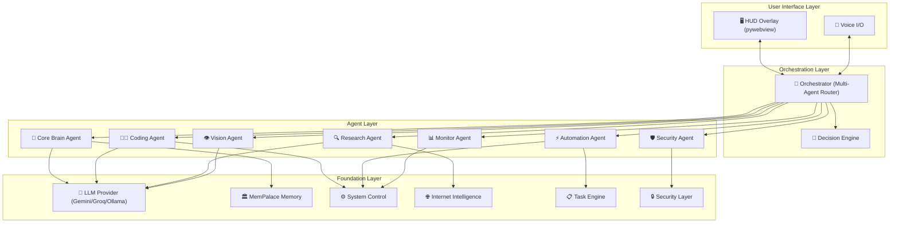
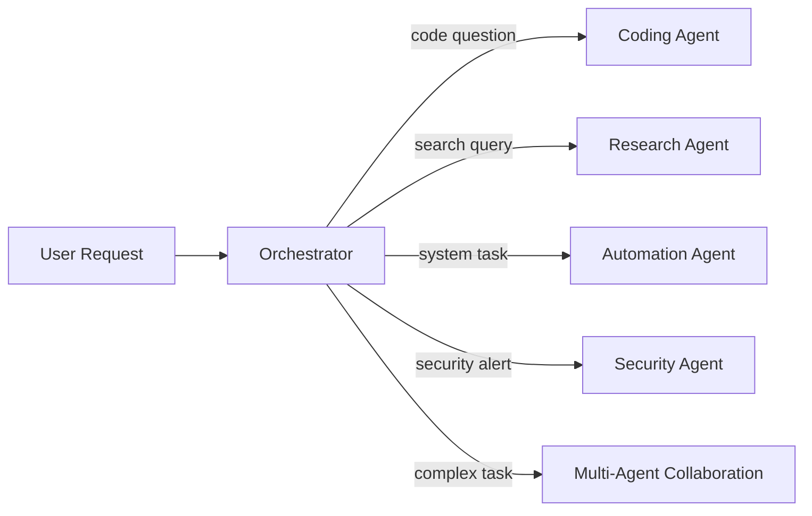

# 🤖 JARVIS v2.0 — Complete AI Assistant

> Building a fully free, Iron Man-inspired AI assistant with 14 core subsystems.

## Architecture Overview



---

## User Review Required

> [!IMPORTANT]
> **LLM Provider Strategy**: The plan uses a cascade approach — Gemini 2.5 Flash (free tier) → Groq (free fallback) → Ollama (offline fallback). This ensures 24/7 availability but means rate-limited usage on cloud providers (~15 RPM Gemini, ~30 RPM Groq). For heavy usage, a local Ollama model is essential. **Do you have a GPU that can run local models (NVIDIA recommended)?**

> [!IMPORTANT]  
> **MemPalace Integration**: MemPalace stores full verbatim conversations locally using ChromaDB. It requires Python 3.9+ and stores all data on your machine. We'll integrate it as Jarvis's long-term memory backbone. **Confirm this approach is acceptable — it will use ~1-2GB disk for the memory database.**

> [!WARNING]
> **Privacy Consideration**: When using Gemini/Groq free tiers, your prompts may be used to improve their models. Sensitive operations (file access, system commands) will ONLY be processed locally through Ollama or locally with sanitized context. The Security Layer strips sensitive data before cloud API calls.

> [!IMPORTANT]
> **System Control Permissions**: Jarvis will execute PowerShell commands on your PC. The plan includes a permission system with allowlists/blocklists and requires voice confirmation for destructive operations. **Do you want a PIN-based or voice-passphrase-based auth for sensitive actions?**

---

## Technology Stack (100% Free)

| Component | Technology | Cost |
|:---|:---|:---|
| **LLM (Primary)** | Gemini 2.5 Flash API (Google AI Studio) | Free (rate-limited) |
| **LLM (Fallback)** | Groq API (Llama 3.3 70B) | Free (rate-limited) |
| **LLM (Offline)** | Ollama (local Llama/Mistral) | Free (your hardware) |
| **STT (Real-time)** | Vosk (lightweight, instant) | Free |
| **STT (Accurate)** | faster-whisper (background transcription) | Free |
| **TTS (Online)** | edge-tts (neural voices, Microsoft) | Free |
| **TTS (Offline)** | Piper TTS / pyttsx3 fallback | Free |
| **Wake Word** | openWakeWord (custom "Hey Jarvis") | Free |
| **Memory** | MemPalace + ChromaDB (local) | Free |
| **Knowledge Graph** | MemPalace KnowledgeGraph (SQLite) | Free |
| **Vision/OCR** | mss + pytesseract + Gemini Vision | Free |
| **Screen Capture** | mss (ultra-fast) | Free |
| **GUI/HUD** | pywebview + HTML/CSS/JS | Free |
| **System Control** | subprocess + psutil + pyautogui | Free |
| **Web Scraping** | httpx + BeautifulSoup4 | Free |
| **Search** | DuckDuckGo API (duckduckgo-search) | Free |
| **Scheduling** | APScheduler (local) | Free |
| **Encryption** | cryptography (Fernet/AES) | Free |

---

## Proposed Changes

### Phase 1: Foundation — Core Brain + Voice System

> The foundation that makes everything else possible. ~3 implementation sessions.

---

#### [NEW] [project structure](file:///d:/Jarvis%20v2.0/)

```
d:\Jarvis v2.0\
├── jarvis\
│   ├── __init__.py
│   ├── main.py                    # Entry point + daemon mode
│   ├── config.py                  # Global config + env management
│   │
│   ├── core\                      # 🧠 Core Brain
│   │   ├── __init__.py
│   │   ├── brain.py               # Main reasoning engine
│   │   ├── llm_provider.py        # LLM cascade (Gemini → Groq → Ollama)
│   │   ├── context_manager.py     # Conversation context + windowing
│   │   └── personality.py         # Tone, humor, style layer
│   │
│   ├── voice\                     # 🎤 Voice System
│   │   ├── __init__.py
│   │   ├── stt_engine.py          # Speech-to-text (Vosk + faster-whisper)
│   │   ├── tts_engine.py          # Text-to-speech (edge-tts + Piper)
│   │   ├── wake_word.py           # "Hey Jarvis" detection (openWakeWord)
│   │   └── audio_manager.py       # Mic/speaker management, interrupt handling
│   │
│   ├── system\                    # 🖥️ System Control
│   │   ├── __init__.py
│   │   ├── commander.py           # PowerShell/command execution
│   │   ├── app_launcher.py        # App/file/folder opener
│   │   ├── os_control.py          # Volume, brightness, Wi-Fi, etc.
│   │   └── workflow_manager.py    # Preset workflows (coding mode, gaming mode)
│   │
│   ├── internet\                  # 🌐 Internet Intelligence
│   │   ├── __init__.py
│   │   ├── search_engine.py       # DuckDuckGo + summarization
│   │   ├── news_filter.py         # Interest-based news
│   │   └── research_engine.py     # Deep-dive multi-source research
│   │
│   ├── automation\                # ⚡ Task Automation
│   │   ├── __init__.py
│   │   ├── task_engine.py         # Multi-step task execution
│   │   ├── scheduler.py           # Time-based scheduling (APScheduler)
│   │   └── trigger_engine.py      # Condition-based triggers
│   │
│   ├── vision\                    # 👁️ Vision System
│   │   ├── __init__.py
│   │   ├── screen_reader.py       # Screen capture + OCR
│   │   ├── image_analyzer.py      # Image recognition via Gemini Vision
│   │   └── webcam_analyzer.py     # Webcam feed analysis
│   │
│   ├── memory\                    # 🧬 Memory System (MemPalace)
│   │   ├── __init__.py
│   │   ├── palace.py              # MemPalace integration wrapper
│   │   ├── short_term.py          # Current conversation buffer
│   │   ├── long_term.py           # MemPalace search + store
│   │   └── knowledge_graph.py     # Entity-relationship tracking
│   │
│   ├── security\                  # 🛡️ Security + Privacy
│   │   ├── __init__.py
│   │   ├── auth.py                # Voice authentication
│   │   ├── encryption.py          # Local data encryption
│   │   ├── permissions.py         # Folder/action allowlist-blocklist
│   │   ├── sanitizer.py           # Strip sensitive data before cloud calls
│   │   └── intrusion_detector.py  # Suspicious activity detection
│   │
│   ├── monitor\                   # ⚡ Real-Time Monitoring
│   │   ├── __init__.py
│   │   ├── system_monitor.py      # CPU, GPU, RAM, battery, network
│   │   ├── smart_actions.py       # Auto-optimization triggers
│   │   └── health_report.py       # System health summaries
│   │
│   ├── agents\                    # 🤖 Multi-Agent System
│   │   ├── __init__.py
│   │   ├── orchestrator.py        # Agent router + coordinator
│   │   ├── base_agent.py          # Base agent class
│   │   ├── coding_agent.py        # Code gen, debugging, review
│   │   ├── research_agent.py      # Deep research + summarization
│   │   ├── automation_agent.py    # Workflow automation
│   │   └── security_agent.py      # Security monitoring agent
│   │
│   ├── decision\                  # 🧠 Decision Engine
│   │   ├── __init__.py
│   │   ├── suggestion_engine.py   # Proactive suggestions
│   │   ├── pattern_detector.py    # Usage pattern recognition
│   │   └── predictor.py           # Anticipate user needs
│   │
│   └── ui\                        # 🕶️ HUD Interface
│       ├── __init__.py
│       ├── hud_window.py          # pywebview window manager
│       ├── static\
│       │   ├── index.html         # Main HUD layout
│       │   ├── style.css          # Iron Man-inspired styling
│       │   └── app.js             # Frontend logic + animations
│       └── api_bridge.py          # Python ↔ JS communication
│
├── data\                          # Local data storage
│   ├── config.yaml                # User configuration
│   ├── permissions.yaml           # Permission rules
│   ├── workflows\                 # Saved workflow definitions
│   └── keys\                      # Encrypted API keys
│
├── requirements.txt
├── setup.py
├── Run_Jarvis.bat                 # One-click launcher
└── Kill_Jarvis.bat                # Clean shutdown
```

---

### Phase 1A: LLM Provider Cascade

#### [NEW] [llm_provider.py](file:///d:/Jarvis%20v2.0/jarvis/core/llm_provider.py)

The heartbeat of Jarvis. Implements a cascade fallback strategy:

1. **Gemini 2.5 Flash** (primary) — free tier, ~15 RPM, excellent multimodal
2. **Groq** (speed fallback) — free tier, ~30 RPM, blazing fast inference (800+ tok/s)
3. **Ollama** (offline fallback) — runs on your hardware, unlimited, private

```python
# Simplified flow:
async def generate(prompt, context):
    try:
        return await gemini_call(prompt)      # Try Gemini first
    except RateLimitError:
        try:
            return await groq_call(prompt)    # Groq fallback
        except RateLimitError:
            return await ollama_call(prompt)  # Fully local fallback
```

Key features:
- **Rate limit tracking** — knows when each provider resets
- **Automatic routing** — sensitive prompts go ONLY to Ollama
- **Context windowing** — manages token limits per provider
- **Response caching** — identical prompts don't waste API calls

---

### Phase 1B: Voice System

#### [NEW] [stt_engine.py](file:///d:/Jarvis%20v2.0/jarvis/voice/stt_engine.py)

Hybrid STT approach:
- **Vosk** (real-time, <100ms latency) — for instant command recognition
- **faster-whisper** (background, high accuracy) — for complex/long speech

#### [NEW] [tts_engine.py](file:///d:/Jarvis%20v2.0/jarvis/voice/tts_engine.py)

Adaptive TTS:
- **edge-tts** (online) — neural-quality Microsoft voices, expressive
- **Piper TTS** (offline fallback) — fast, good quality, no internet needed
- **Emotion-aware** — adapts tone (serious vs casual) based on context

#### [NEW] [wake_word.py](file:///d:/Jarvis%20v2.0/jarvis/voice/wake_word.py)

- openWakeWord with custom "Hey Jarvis" model
- Always listening in background (low CPU, ~2% usage)
- Interrupt handling — user can cut off Jarvis mid-sentence

---

### Phase 2: System Control + Internet Intelligence

#### [NEW] [commander.py](file:///d:/Jarvis%20v2.0/jarvis/system/commander.py)

PowerShell execution engine with safety layers:
- **Allowlisted commands** — pre-approved safe operations
- **Confirmation required** — for anything destructive (delete, format, etc.)
- **Sandbox mode** — can run commands in restricted context
- **No access to sensitive paths** without explicit permission

#### [NEW] [search_engine.py](file:///d:/Jarvis%20v2.0/jarvis/internet/search_engine.py)

- DuckDuckGo search (unlimited, free, no API key)
- Multi-source summarization via LLM
- Trend detection (compare results across time)
- Auto-verification (cross-reference multiple sources)

---

### Phase 3: Task Automation + Vision

#### [NEW] [task_engine.py](file:///d:/Jarvis%20v2.0/jarvis/automation/task_engine.py)

Multi-step execution pipeline:
```
User: "Download dataset, clean it, visualize, and summarize"
→ Jarvis breaks into steps → executes sequentially → reports progress
```

Features:
- DAG-based task dependencies
- Parallel step execution where possible
- Progress reporting through HUD
- Failure recovery + retry logic

#### [NEW] [trigger_engine.py](file:///d:/Jarvis%20v2.0/jarvis/automation/trigger_engine.py)

Condition-based automation:
- `if battery < 20% → enable power saver`
- `if CPU > 90% for 5min → suggest fix`
- `if time == 9AM → morning briefing`
- User-definable YAML trigger rules

#### [NEW] [screen_reader.py](file:///d:/Jarvis%20v2.0/jarvis/vision/screen_reader.py)

- **mss** for ultra-fast screen capture
- **pytesseract** for OCR text extraction
- **Gemini Vision API** for understanding complex screen content
- "Explain this code on screen" / "What error is this?"

---

### Phase 4: Memory System (MemPalace Integration)

#### [NEW] [palace.py](file:///d:/Jarvis%20v2.0/jarvis/memory/palace.py)

Deep integration with MemPalace:

```python
# Initialize palace for Jarvis
# mempalace init ~/jarvis-memory

# Structure:
# Wing: "user" — your habits, preferences, routines
# Wing: "projects" — per-project knowledge
# Wing: "conversations" — full conversation history
# Wing: "system" — learned system patterns
```

Features:
- **Auto-mining** — conversations auto-stored after each session
- **Semantic search** — "What did I say about auth last week?"
- **Knowledge graph** — entity relationships with temporal validity
- **Wake-up context** — loads 170 tokens of critical facts on startup
- **Specialist agents** — MemPalace agents for different domains

---

### Phase 5: Security + Monitoring

#### [NEW] [auth.py](file:///d:/Jarvis%20v2.0/jarvis/security/auth.py)

- Voice print authentication (speaker verification)
- PIN/passphrase for sensitive operations
- Session-based auth (re-auth after idle timeout)

#### [NEW] [sanitizer.py](file:///d:/Jarvis%20v2.0/jarvis/security/sanitizer.py)

- Strips file paths, passwords, API keys from prompts before cloud calls
- Regex + pattern matching for PII detection
- Replaces sensitive data with `[REDACTED]` tokens

#### [NEW] [system_monitor.py](file:///d:/Jarvis%20v2.0/jarvis/monitor/system_monitor.py)

Continuous monitoring (every 5s polling cycle):
- CPU, GPU, RAM usage
- Network activity (bandwidth, connections)
- Battery health + charging status
- Disk usage + health
- Running processes
- **Privacy**: Only metrics leave to cloud, never raw process lists

---

### Phase 6: Multi-Agent System + Decision Engine

#### [NEW] [orchestrator.py](file:///d:/Jarvis%20v2.0/jarvis/agents/orchestrator.py)

Central coordinator that routes requests to specialized agents:



Features:
- LLM-powered intent classification
- Agent capability matching
- Parallel agent execution for complex tasks
- Result aggregation + conflict resolution

#### [NEW] [suggestion_engine.py](file:///d:/Jarvis%20v2.0/jarvis/decision/suggestion_engine.py)

Proactive intelligence:
- "You've been coding 3 hours — take a break"
- "You usually open VS Code at this time"
- "Your RAM is filling up — close unused Chrome tabs?"
- Learns from MemPalace patterns over time

---

### Phase 7: HUD Interface (Iron Man UI)

#### [NEW] [hud_window.py](file:///d:/Jarvis%20v2.0/jarvis/ui/hud_window.py)

pywebview-based floating HUD:
- Frameless, transparent, always-on-top
- Trigger on wake word / double-clap / hotkey
- Minimizes to system tray when inactive

#### [NEW] [index.html](file:///d:/Jarvis%20v2.0/jarvis/ui/static/index.html) + [style.css](file:///d:/Jarvis%20v2.0/jarvis/ui/static/style.css) + [app.js](file:///d:/Jarvis%20v2.0/jarvis/ui/static/app.js)

Iron Man-inspired design:
- **Color palette**: Cyan (#00d4ff), deep navy (#0a0e27), electric blue accents
- **Glassmorphism**: Frosted glass panels with blur
- **Animations**: Pulse rings on voice activity, real-time waveform
- **Dashboard panels**: System stats, conversation, agent status
- **Voice-first**: Large waveform visualizer, minimal typing needed
- **Responsive**: Adapts to different overlay sizes

Key UI components:
1. **Central Arc Reactor** — pulsing core animation showing Jarvis is active
2. **Voice Waveform** — real-time audio visualization
3. **Conversation Panel** — scrollable chat with Jarvis responses
4. **System Dashboard** — CPU/RAM/GPU/Battery gauges
5. **Agent Status** — which agents are active
6. **Quick Actions** — common commands as floating buttons

---

### Phase 8: IoT-Ready Architecture (Future-Proofed)

> [!NOTE]
> Not implemented now, but the architecture supports future IoT with:
> - Plugin-based device drivers in `jarvis/plugins/iot/`
> - MQTT protocol support ready to add
> - Standard device interface (`turn_on()`, `turn_off()`, `set_level()`)
> - Discovery service for local network devices

---

## Implementation Order

| Phase | Components | Priority | Est. Sessions |
|:---|:---|:---|:---|
| **1A** | LLM Provider Cascade + Config | 🔴 Critical | 1 |
| **1B** | Voice System (STT + TTS + Wake Word) | 🔴 Critical | 2 |
| **2** | System Control + Internet | 🟠 High | 2 |
| **3** | Task Automation + Vision | 🟠 High | 2 |
| **4** | MemPalace Memory Integration | 🟠 High | 1 |
| **5** | Security + Monitoring | 🟡 Medium | 1 |
| **6** | Multi-Agent + Decision Engine | 🟡 Medium | 2 |
| **7** | HUD Interface | 🟡 Medium | 2 |
| **8** | Polish + Integration Testing | 🟢 Final | 1 |

**Total: ~14 coding sessions**

---

## Open Questions

> [!IMPORTANT]
> **1. Do you have a GPU for local LLM (Ollama)?** This affects whether we can have a truly offline fallback. If not, we'll rely more heavily on Gemini/Groq free tiers.

> [!IMPORTANT]
> **2. Do you already have Gemini and/or Groq API keys?** We need at least one cloud provider key to start. Both are free to get:
> - Gemini: [Google AI Studio](https://aistudio.google.com/)
> - Groq: [Groq Console](https://console.groq.com/)

> [!IMPORTANT]
> **3. Authentication preference?** For sensitive system operations, do you prefer:
> - (A) Voice passphrase ("Jarvis, authorize: [phrase]")
> - (B) PIN code typed into HUD
> - (C) Both options

> [!IMPORTANT]
> **4. Which phase should we start building first?** The plan goes Phase 1A → 1B → 2 → ... but if you want to see the HUD first for motivation, we can reorder.

> [!IMPORTANT]
> **5. Previous Jarvis v1.0**: I see you had a previous Jarvis build (from past conversations with daemon mode, holographic GUI, double-clap trigger). Should we **port any specific features** from that version, or is this a complete rebuild?

---

## Verification Plan

### Automated Tests
- **LLM Provider**: Test cascade with mock rate limits → verify fallback chain works
- **Voice**: Record test audio → verify STT accuracy > 90%
- **System Control**: Execute sandboxed PowerShell commands → verify output
- **Memory**: Store + retrieve conversations → verify MemPalace recall
- **Security**: Attempt blocked operations → verify denial

### Manual Verification
- **End-to-end voice flow**: Say "Hey Jarvis" → ask question → hear response
- **System control**: "Open Notepad" → verify it opens
- **HUD**: Visual inspection of Iron Man-style interface
- **Memory**: Multi-session continuity test (remember past conversations)

---

## Dependencies to Install

```bash
pip install google-generativeai      # Gemini API
pip install groq                      # Groq API
pip install ollama                    # Local LLM client
pip install vosk                      # Real-time STT
pip install faster-whisper            # Accurate STT
pip install edge-tts                  # Neural TTS
pip install openwakeword              # Wake word detection
pip install mempalace                 # Memory system
pip install pywebview                 # HUD GUI
pip install psutil                    # System monitoring
pip install pyautogui                 # GUI automation
pip install mss                       # Screen capture
pip install pytesseract               # OCR
pip install httpx                     # Async HTTP
pip install beautifulsoup4            # HTML parsing
pip install duckduckgo-search         # Web search
pip install apscheduler               # Task scheduling
pip install cryptography              # Encryption
pip install sounddevice               # Audio I/O
pip install numpy                     # Audio processing
pip install pyyaml                    # Config files
pip install pywin32                   # Windows API
```
